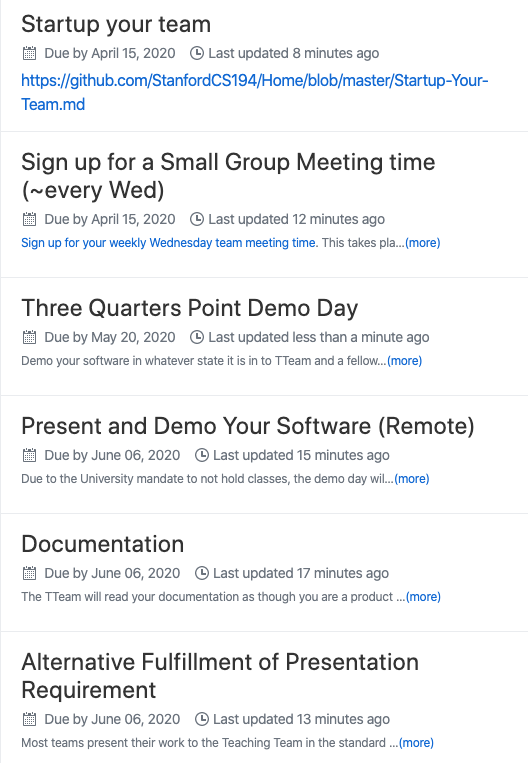

# Welcome to Stanford CS194 & CS194W

Once you've been added to the course Github organization, you should access [the collaborative syllabus here](https://github.com/StanfordCS194/Home/milestones).  For ease of reference, a static view is included below. When you have joined the StanfordCS194 Github organization by virtue of filling out [this form](https://docs.google.com/forms/d/e/1FAIpQLSfxCDv83ZFyZRIw9lag36EzIsuCZB4sDef7qfC033sPHwXFzA/viewform) AND being registered in Axess, please be sure you are watching the **[Home](https://github.com/StanfordCS194/Home) repository** with whatever form of Github notifications you prefer turned on, so you are sure to receive course announcements.

